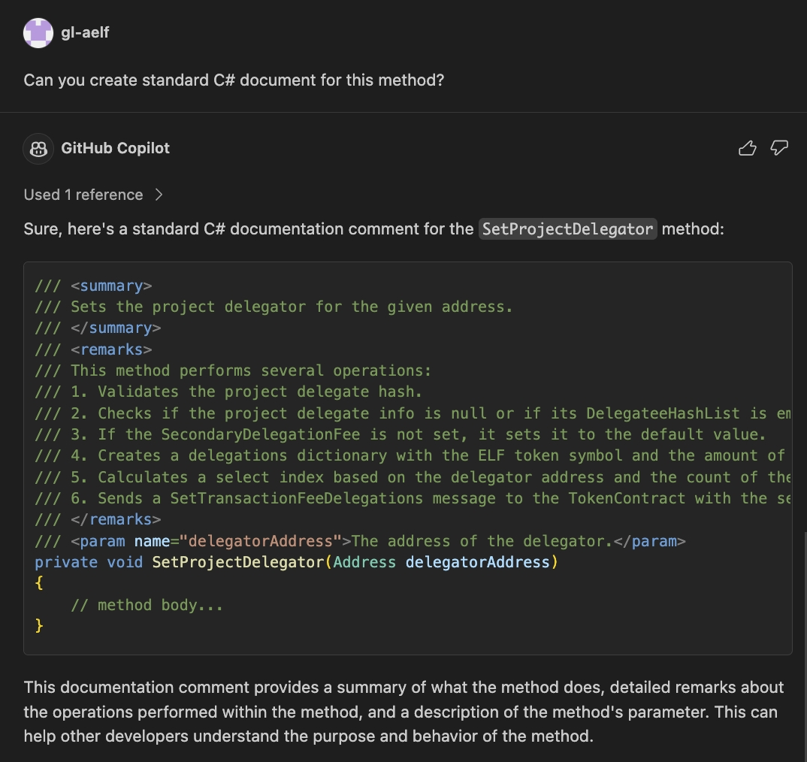

# AELF Smart Contract Development Guidelines

## Hard Requirements

### Pick Meaningful Names

### Run Through CoPilot or ChatGPT on Namings

### Write Small Methods

### Separate Admin and User Interfaces

## Suggested Patterns
### Add Documentation to All Public Methods
Your public methods should all have clear explanation about the functionality and logics contained in it.

Tip: GitHub Copilot can be used to help you add a proper documentation for your method. Below is an example.

## Follow Check-Effect-Interaction Pattern
