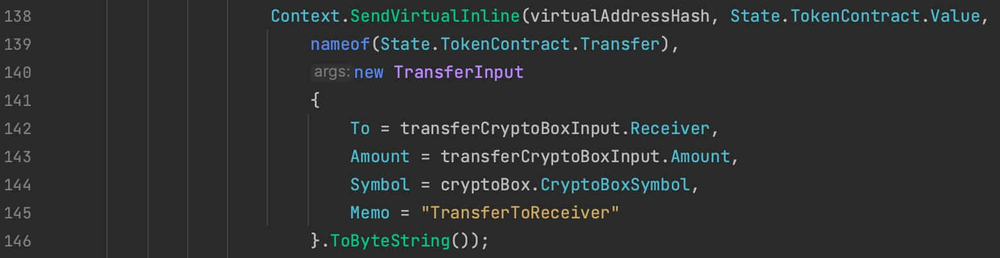
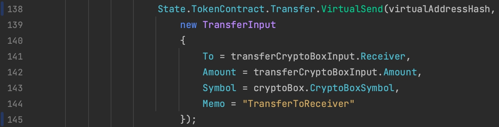

# AELF Smart Contract Development Guidelines

## Hard Requirements

### Pick Meaningful Names

### Run Through CoPilot or ChatGPT on Namings

### Write Small Methods

### Separate Admin and User Interfaces

### Avoid Using `Context.SendVirtualInline` Directly

`Context.SendVirtualInline` is an API provided by the context, however to write cleaner code, the method binding in RefereceContractState provides a `VirtualSend` utility method where we can supply a virtual address hash along with the request input to send an inline call directly. So there's no need to call `Context.SendVirtualInline` directly, we can do `<Contract>.<Method>.VirtualSend(virtualHash, methodInput)` instead.

For example, the `Context.SendVirtualInline` call in the following code can be replaced with `State.TokenContract.Transfer.VirtualSend`.

## Suggested Patterns
### Add Documentation to All Public Methods
Your public methods should all have clear explanation about the functionality and logics contained in it.

Tip: GitHub Copilot can be used to help you add a proper documentation for your method. Below is an example.

## Follow Check-Effect-Interaction Pattern
