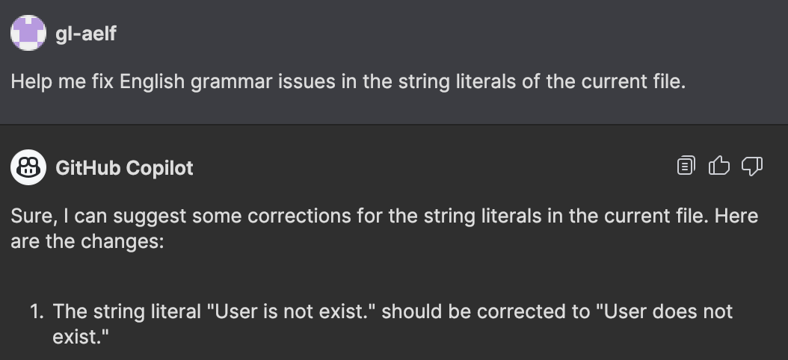

# AELF Smart Contract Development Guidelines

## Hard Requirements

### Pick Meaningful Names

### Run Through Copilot or ChatGPT on Namings

If you aren't sure about certain English grammar related issues. Ask Copilot to fix them for you. For example, the following assert message `User is not exist.` is not following correct grammar. You can 

```csharp
Assert(State.UserList.Value.Users.FirstOrDefault(v =>v.Id == input.User.Id) != null, "User is not exist.");
```
Below is an example showing how you could prompt Copilot to fix such issues for you.



Besides string literals in assert messages, you could ask Copilot to suggest better names for your methods as well. This is citical as a good names help you communicate the intention of your code and hence improves your code readability. For example you can select your method and prompt Copilot like `Help me pick a suitable name for the method.` You can choose from the suggested names given by Copilot.

### Write Small Methods

### Separate Admin and User Interfaces

For example, the following is the proto definitions of a `BingGameContract`. Now it contains all the methods, messages and events as well as contract metadata such as namespace and state names. If you think about the usage of the interface, you will quickly realize that the information like the contract state name is not interested if it's used for calling this contract on the client side. You will also realize that the methods (actions and views) can be broken down into two categories (one for admins and one for normal users). If we understand this and follow the *Interface Segregation Principle* of the SOLID principles, we can do a better job by separating it into a few proto files.

#### A Naive Proto File

```proto
syntax = "proto3";

import "aelf/core.proto";
import "aelf/options.proto";
import "google/protobuf/empty.proto";
import "google/protobuf/wrappers.proto";
import "google/protobuf/timestamp.proto";
import "acs12.proto";

option csharp_namespace = "Contracts.BingoGameContract";

service BingoGameContract {

  option (aelf.csharp_state) = "Contracts.BingoGame.BingoGameState";
  option (aelf.base) = "acs12.proto";
  
  // Actions
  rpc Play (PlayInput) returns (PlayOutput) {
  }

  rpc Bingo (aelf.Hash) returns (google.protobuf.Empty) {
  }

  rpc Initialize (google.protobuf.Empty) returns (google.protobuf.Empty) {
  }

  rpc ChangeAdmin (aelf.Address) returns (google.protobuf.Empty) {
  }

  // Views
  
  rpc GetAdmin (google.protobuf.Empty) returns (aelf.Address) {
    option (aelf.is_view) = true;
  }
}

// Messages
message PlayInput {
  bool reset_start = 1;
  int32 dice_count = 2;
  bool execute_bingo = 3;
}

message PlayOutput {
  int64 expected_block_height = 1;
}

// Events
message Played {
  option (aelf.is_event) = true;
  int64 play_block_height = 1;
  aelf.Hash play_id = 2;
  aelf.Address player_address = 3;
}

message Bingoed {
  option (aelf.is_event) = true;
  int64 play_block_height = 1;
  GridType grid_type = 2;
  int32 grid_num = 3;
  int64 score = 4;
  bool is_complete = 5;
  aelf.Hash play_id = 6;
  int64 bingo_block_height = 7;
  aelf.Address player_address = 8;
  int32 dice_count = 9;
  DiceList dice_numbers = 10;
  int32 start_grid_num = 11;
  int32 end_grid_num = 12;
}


enum GridType {
  Blue = 0;
  Red = 1;
  Gold = 2;
}

message DiceList {
  repeated int32 value = 1;
}
```

#### A Better Organization of Proto Files

##### The Main Contract

The main contract is only needed when you write your smart contract and the client side won't need it.

```proto
syntax = "proto3";

import "aelf/core.proto";
import "aelf/options.proto";
import "google/protobuf/empty.proto";
import "google/protobuf/wrappers.proto";
import "google/protobuf/timestamp.proto";
import "acs12.proto";

option csharp_namespace = "Contracts.Bingo";

service BingoContractMain {
  option (aelf.csharp_state) = "Contracts.Bingo.BingoState";
  option (aelf.base) = "acs12.proto";
  option (aelf.base) = "bingo-contract.proto";
  option (aelf.base) = "bingo-contract-admin.proto";
}
```


##### The Shared Interface Between the Contract and the Client

`bingo-contract.proto` will be needed both by the contract and the client side where interaction to this contract is needed.

```proto
syntax = "proto3";

import "aelf/core.proto";
import "aelf/options.proto";
import "google/protobuf/empty.proto";
import "google/protobuf/wrappers.proto";
import "google/protobuf/timestamp.proto";
import "acs12.proto";

service BingoContract {
  // Actions
  rpc Play (PlayInput) returns (PlayOutput) {
  }

  rpc Bingo (aelf.Hash) returns (google.protobuf.Empty) {
  }
}

// Messages
message PlayInput {
  bool reset_start = 1;
  int32 dice_count = 2;
  bool execute_bingo = 3;
}

message PlayOutput {
  int64 expected_block_height = 1;
}

// Events
message Played {
  option (aelf.is_event) = true;
  int64 play_block_height = 1;
  aelf.Hash play_id = 2;
  aelf.Address player_address = 3;
}

message Bingoed {
  option (aelf.is_event) = true;
  int64 play_block_height = 1;
  GridType grid_type = 2;
  int32 grid_num = 3;
  int64 score = 4;
  bool is_complete = 5;
  aelf.Hash play_id = 6;
  int64 bingo_block_height = 7;
  aelf.Address player_address = 8;
  int32 dice_count = 9;
  DiceList dice_numbers = 10;
  int32 start_grid_num = 11;
  int32 end_grid_num = 12;
}


enum GridType {
  Blue = 0;
  Red = 1;
  Gold = 2;
}

message DiceList {
  repeated int32 value = 1;
}

```

##### The Interface Facing the Operator/Admin of the Game


`bingo-contract-admin.proto` will be needed both by the contract and the operator of the dApp and is not required by other applications facing the end users.

`bingo-contract-admin.proto`:
```proto
syntax = "proto3";

import "aelf/core.proto";
import "aelf/options.proto";
import "google/protobuf/empty.proto";

service BingoContractAdmin {
  // Actions
  rpc Initialize (google.protobuf.Empty) returns (google.protobuf.Empty) {}

  rpc ChangeAdmin (aelf.Address) returns (google.protobuf.Empty) {}

  // Views
  rpc GetAdmin (google.protobuf.Empty) returns (aelf.Address) {
    option (aelf.is_view) = true;
  }
}
```


### Avoid Using `Context.SendVirtualInline` Directly

`Context.SendVirtualInline` is an API provided by the context, however to write cleaner code, the method binding in RefereceContractState provides a `VirtualSend` utility method where we can supply a virtual address hash along with the request input to send an inline call directly. So there's no need to call `Context.SendVirtualInline` directly, we can do `<Contract>.<Method>.VirtualSend(virtualHash, methodInput)` instead.

For example, the `Context.SendVirtualInline` call in the following code can be replaced with `State.TokenContract.Transfer.VirtualSend`.


## Suggested Patterns
### Add Documentation to All Public Methods
Your public methods should all have clear explanation about the functionality and logics contained in it.

Tip: GitHub Copilot can be used to help you add a proper documentation for your method. Below is an example.


## Follow Check-Effect-Interaction Pattern
